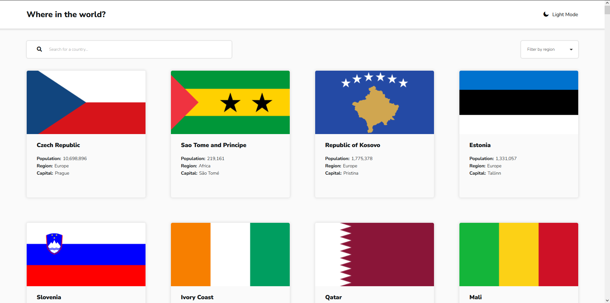

# Frontend Mentor - Countries search app with color theme switcher solution

This is a solution to the [Countries search app with color theme switcher challenge on Frontend Mentor](https://www.frontendmentor.io/challenges/rest-countries-api-with-color-theme-switcher-5cacc469fec04111f7b848ca).

## Table of contents

- [Overview](#overview)
  - [The challenge](#the-challenge)
  - [Screenshot](#screenshot)
  - [Links](#links)
- [My process](#my-process)
  - [Built with](#built-with)
  - [What I learned](#what-i-learned)
  - [Continued development](#continued-development)
  - [Useful resources](#useful-resources)
- [Author](#author)
- [Acknowledgments](#acknowledgments)

## Overview

### The challenge

Users should be able to:

- See all countries from the API on the homepage
- Search for a country using an `input` field
- Filter countries by region
- Click on a country to see more detailed information on a separate page
- Click through to the border countries on the detail page
- Toggle the color scheme between light and dark mode _(optional)_

### Screenshot

### Links

- Solution URL: [Add solution URL here](https://your-solution-url.com)
- Live Site URL: [Add live site URL here](https://your-live-site-url.com)

## My process

### Built with

- Semantic HTML5 markup
- CSS variables, SCSS - CSS extension, custom, data attributes
- Flexbox
- CSS Grid
- Desktop-first workflow
- Vanilla JavaScript

### What I learned

- Handling errors appropriately
- Refined, different syntactical aproaches to solving problems
- Accessibility aspect deep-dive
- New CSS approaches to gaining better control over certain HTML elements and their positioning concerning responsive design
- Deeper understanding and reasoning behind adopting more flexible ways to build certain parts of the application
- Clean, efficient way to define theme patterns and using them over the app in a simplest way having best practices in mind
- Refined aproach to refactoring the code using best practices

### Continued development

- Will focus mostly on refining React skills, alongside Next technologies, sometimes building same apps I built using Vanilla JS to gain better perspective of their advantages and different aproaches and staying up to date with cutting-edge technologies

## Author

- Github - [Zdravko Delić](https://github.com/Zdravko93)
- Frontend Mentor Profile - [@Zdravko93](https://www.frontendmentor.io/profile/Zdravko93)
