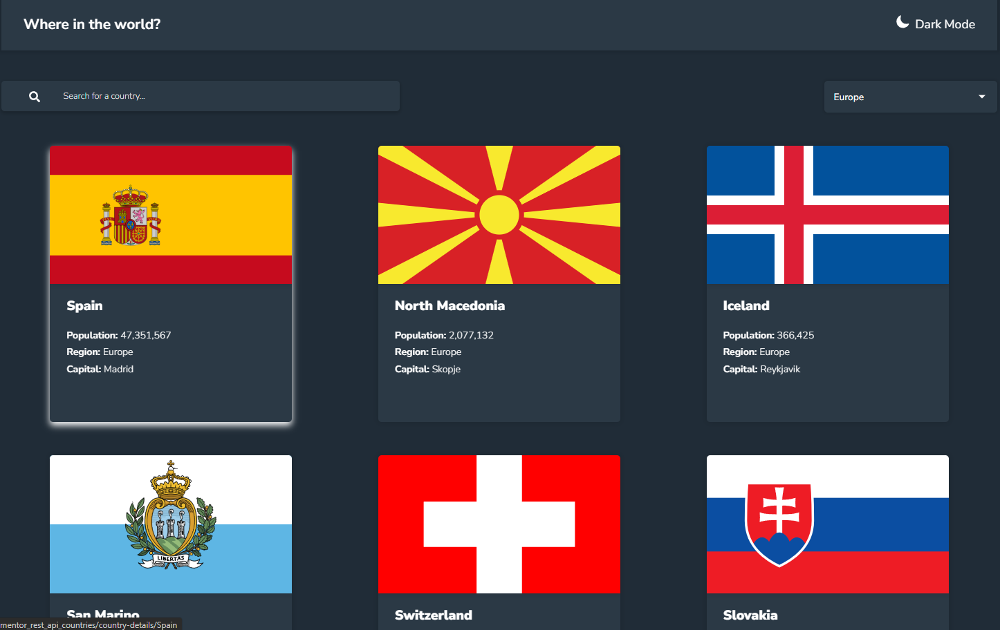

# Frontend Mentor - Countries search app with color theme switcher solution

This is a solution to the [Countries search app with color theme switcher challenge on Frontend Mentor](https://www.frontendmentor.io/challenges/rest-countries-api-with-color-theme-switcher-5cacc469fec04111f7b848ca).

## Table of contents

- [Overview](#overview)
  - [The challenge](#the-challenge)
  - [Screenshot](#screenshot)
  - [Links](#links)
- [My process](#my-process)
  - [Built with](#built-with)
  - [What I learned](#what-i-learned)
  - [Continued development](#continued-development)
  - [Useful resources](#useful-resources)
- [Author](#author)
- [Acknowledgments](#acknowledgments)

## Overview

### The challenge

Users should be able to:

- See all countries from the API on the homepage
- Search for a country using an `input` field
- Filter countries by region
- Click on a country to see more detailed information on a separate page
- Click through to the border countries on the detail page
- Toggle the color scheme between light and dark mode _(optional)_

### Screenshot

### Links

- Solution URL: (https://github.com/Zdravko93/react_frontendmentor_rest_api_countries/tree/main)
- Live Site URL: (https://zdravko93.github.io/react_frontendmentor_rest_api_countries/)

## My process

### Built with

- React framework (including useState, useContext, useEffect) - JavaScript library for building user interfaces
- CSS Modules – For scoped, maintainable styling
- Flexbox & CSS Grid – For layout and responsive design
- Custom Hooks – For better code organization
- Mobile-First Workflow – Ensures a great user experience across devices

### What I learned

- CSS Best Practices: Gained a deeper understanding of how to effectively use Flexbox and CSS Grid for responsive design
- React State Management: Learned how to use useContext for global state management, improving app structure and scalability
- API Integration: Enhanced my skills in fetching and managing data from external APIs
- Dark/Light Mode: Developed an efficient approach for implementing a color theme switcher, allowing users to toggle between dark and light modes seamlessly
- Code Refactoring: Refined my code organization and structure, making it more modular and easier to maintain

### Continued Development

I plan to continue improving this project by adding more features like:
- A search suggestion feature
- Implementing pagination or infinite scrolling for faster loading times
- Further refactoring the code for better performance and scalability
- Implementing unit and integration tests using Jest or React Testing Library

### Useful Resources

- [React Docs](https://reactjs.org/docs/getting-started.html)
- [Frontend Mentor Challenge Details](https://www.frontendmentor.io/challenges/rest-countries-api-with-color-theme-switcher-5cacc469fec04111f7b848ca)

## Author

- Github - [Zdravko Delić](https://github.com/Zdravko93)
- Frontend Mentor Profile - [@Zdravko93](https://www.frontendmentor.io/profile/Zdravko93)

## Acknowledgments

- Special thanks to the Frontend Mentor community for providing the challenge and resources
- Thanks to all the open-source libraries that made this project possible.
