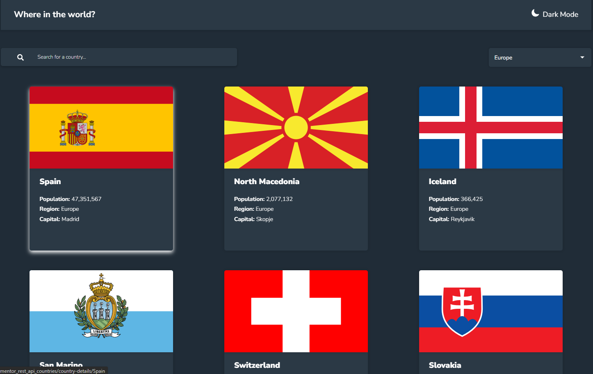

# Frontend Mentor - Countries Search App with Color Theme Switcher solution

This is a solution to the [Countries search app with color theme switcher challenge on Frontend Mentor](https://www.frontendmentor.io/challenges/rest-countries-api-with-color-theme-switcher-5cacc469fec04111f7b848ca).

## Table of contents

- [Overview](#overview)
  - [The challenge](#the-challenge)
  - [Screenshot](#screenshot)
  - [Links](#links)
- [My process](#my-process)
  - [Built with](#built-with)
  - [What I learned](#what-i-learned)
  - [Continued development](#continued-development)
  - [Useful resources](#useful-resources)
- [Author](#author)
- [Acknowledgments](#acknowledgments)

## Overview

### The challenge

Users should be able to:

- See all countries from the API on the homepage
- Search for a country using an `input` field
- Filter countries by region
- Click on a country to see more detailed information on a separate page
- Navigate to border countries from the detail page
- Toggle the color scheme between light and dark mode _(optional)_

### Screenshot

### Links

- Solution URL: (https://github.com/Zdravko93/react_frontendmentor_rest_api_countries/tree/main)
- Live Site URL: (https://zdravko93.github.io/react_frontendmentor_rest_api_countries/)

## My process

### Built with

- React (including useState, useContext, useEffect) – JavaScript library for building user interfaces
- CSS Modules – For scoped, maintainable styling
- Flexbox & CSS Grid – For layout and responsive design
- Custom Hooks – For better code organization
- Mobile-First Workflow – Ensures a smooth experience across all devices

### What I learned

- CSS Best Practices: Gained deeper understanding of Flexbox and CSS Grid for responsive design
- React State Management: Learned how to use useContext for global state, improving app structure and scalability
- API Integration: API Integration: Enhanced skills in fetching and managing data from external APIs
- Dark/Light Mode: Implemented an efficient color theme switcher for seamless toggling between light and dark modes
- Code Refactoring: Improved modularity and maintainability of the code

### Continued Development

Planned improvements for the project include:
- Adding search suggestions for faster results
- Implementing pagination or infinite scrolling for better performance
- Further refactoring for scalability and maintainability
- Writing unit and integration tests using Jest or React Testing Library

### Useful Resources

- [React Docs](https://reactjs.org/docs/getting-started.html)
- [Frontend Mentor Challenge Details](https://www.frontendmentor.io/challenges/rest-countries-api-with-color-theme-switcher-5cacc469fec04111f7b848ca)

## Author

- Github - [Zdravko93](https://github.com/Zdravko93)
- Frontend Mentor - [@Zdravko93](https://www.frontendmentor.io/profile/Zdravko93)

## Acknowledgments

- Thanks to the Frontend Mentor community for the challenge and resources
- Thanks to open-source libraries that made this project possible
